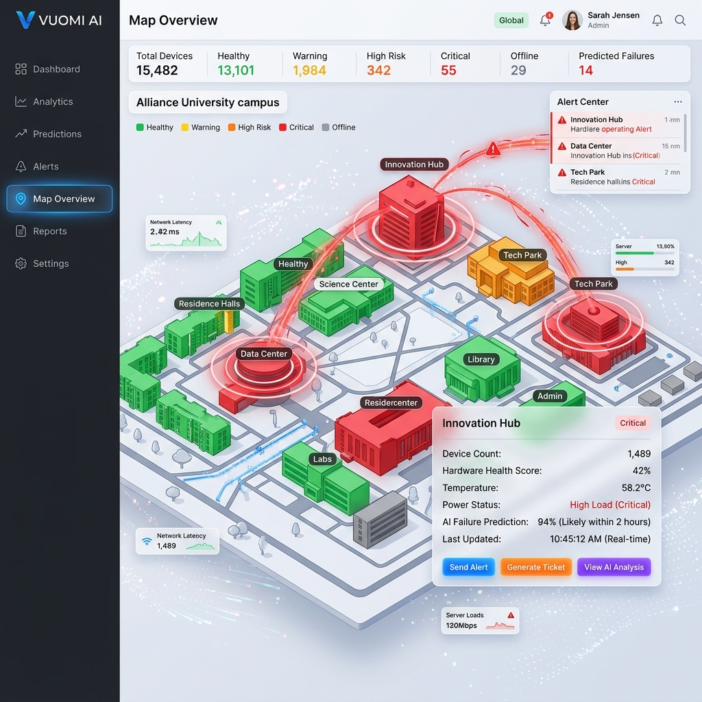

# Sentinel AI - Startup and Demo Guide

Welcome to the Sentinel AI interactive demo! This guide will walk you through how to start the application on your local machine and how to present the interactive ML features to stakeholders.



---

## 1. Prerequisites

Before starting, ensure you have the following installed on your machine:
- **Node.js** (v18 or higher)
- **Python** (v3.10 or higher)
- **Git**

## 2. Installation & Startup

Sentinel AI runs a Next.js React frontend and a FastAPI Python backend. For the ML models to serve predictions to the UI, both services must be running simultaneously.

### Step 2.1: Start the Backend (Machine Learning API)
1. Open a new terminal window.
2. Navigate to the `backend` directory:
   ```bash
   cd backend
   ```
3. Activate the Python virtual environment:
   - **Windows**: `venv\Scripts\activate`
   - **Mac/Linux**: `source venv/bin/activate`
4. Start the FastAPI server:
   ```bash
   python -m uvicorn app.main:app --host 0.0.0.0 --port 9000
   ```
   *The ML engine is now listening on port 9000.*

### Step 2.2: Start the Frontend (User Interface)
1. Open a **second** terminal window.
2. Navigate to the root directory (`sentinel-ai`):
   ```bash
   cd sentinel-ai
   ```
3. Start the Next.js development server:
   ```bash
   npm run dev
   ```
4. Open your web browser and navigate to `http://localhost:3000`.

---

## 3. How to Demo the Platform

Once the application is running, follow this script to demonstrate the core capabilities of the Predictive AI.

### 3.1 The Global Map
1. **Navigate to the "Map" tab on the sidebar.**
2. **Explain**: "This is the Digital Twin of our data center. Currently, all nodes are Green (Healthy)."
3. **Action**: Toggle the **AI Risk Heatmap** at the top right.
4. **Explain**: "When we toggle the Risk Heatmap, we are no longer looking at current status, but *predicted future status*. Notice how Rack 4 turns Amber. The AI has detected anomalous telemetry that suggests a future failure, even though the rack is technically operating normally right now."

### 3.2 The Interactive AI Demo (The "/test" Route)
The easiest way to prove the ML model works is to use the interactive simulation dashboard.
1. **Navigate to `http://localhost:3000/test`** or click the "Test/Simulate" button in the navigation bar.
2. **Explain**: "This dashboard allows us to inject synthetic anomalies directly into the live ML pipeline."


#### Scenario A: Storage Degradation
1. Click the button labeled **"Inject S.M.A.R.T. Anomaly"**.
2. **Watch the UI**: The prediction latency gauge will spike, then settle in under 2 seconds. The AI Risk Score for the selected drive will jump from 5% to 88%.
3. **Show the Explainability**: Point to the "AI Diagnosis" box that appears. It will explain: *"Detected a 400% increase in Reallocated Sector Counts. Probability of drive failure within 14 days is high."*

#### Scenario B: Thermal Runaway
1. Click the button labeled **"Simulate Cooling Failure"**.
2. **Watch the UI**: The thermal gradient graph will sharply incline. The ML model will flag a Critical Alert.
3. **Action**: Click the **"Generate Auto-Ticket"** button to show how the system seamlessly transitions from prediction to automated operational remediation.

## 4. Troubleshooting
- **"The UI is loading forever"**: Ensure your Python backend is running on Port 9000.
- **"I see a CORS error in the console"**: Ensure you are accessing the frontend via `localhost` and not `127.0.0.1`.

---
*Happy Demoing!*
